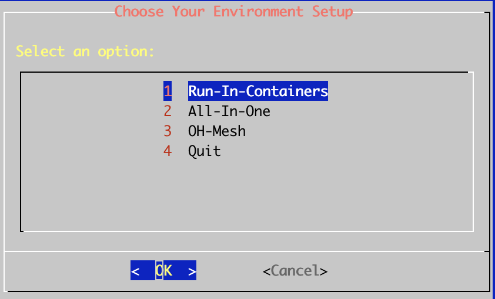
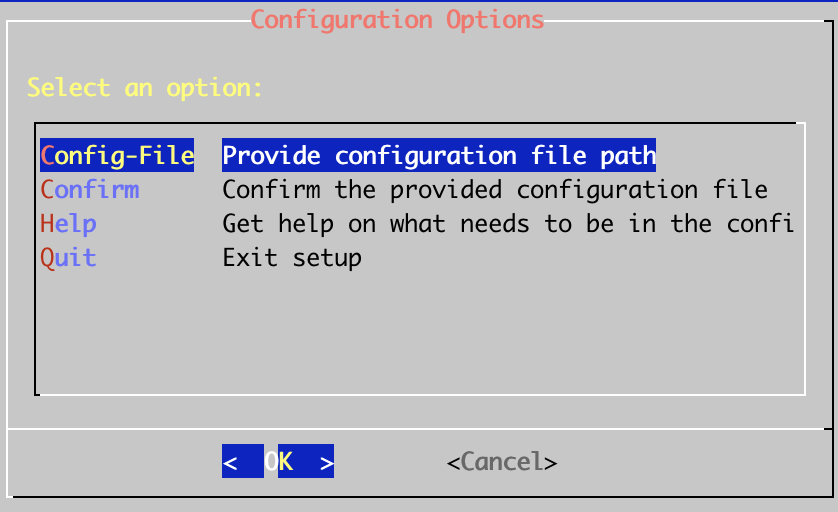
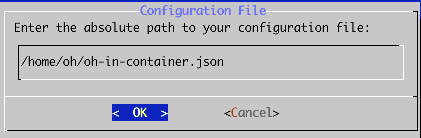

### Open Horizon Bee Stack
This project is intended to integrate Open Horizon with Bee Stack to lower barrier of entry and streamline development effort.

Open Horizon is a platform for managing the service software lifecycle of containerized workloads and related machine learning assets.  It enables autonomous management of applications deployed to distributed webscale fleets of edge computing nodes and devices without requiring on-premise administrators.  You can fine more info here https://open-horizon.github.io/

### Installation
If you can't use Docker Desktop
https://developer-stage.dc4.usva.ibm.com/blogs/awb-rancher-desktop-alternative-to-docker-desktop.

Make a copy of sample-template.json and fill in the necessary values

Run 
```
curl -sSL https://raw.githubusercontent.com/playground/hzn-cli/main/install.sh --output install.sh && bash ./install.sh
```
Select Run-In-Containers


Select Provide configuration file path


Enter path to your tempate file, for example "/home/oh/oh-in-container.json"


Confirm and proceed to install.  Once installation is complete, open-horizon-bee-stack container will be started.  

Go inside the container to start Bee Stack setup